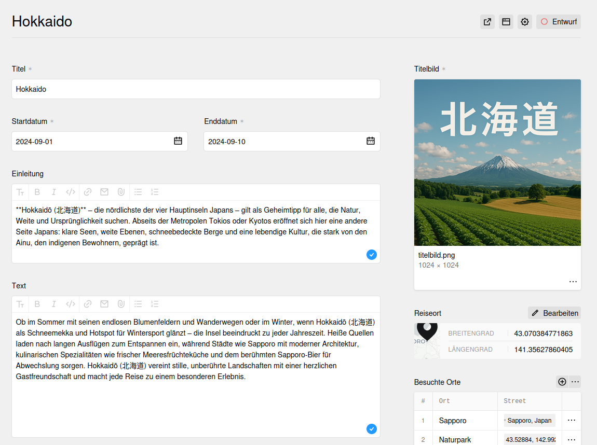

# Journey Journal

A plugin for creating a travel blog or a journal for journeys with kirby.



## Overview

> This plugin is completely free and published under the MIT license.

## Installation

### Download

Download and copy this repository to `/site/plugins/journey-journal`.

### Git submodule

```
git submodule add https://github.com/road42/journey-journal.git site/plugins/journey-journal
```

### Composer

```
composer require road42/journey-journal
```

## Setup

> *TODO: Additional instructions on how to configure the plugin (e.g. blueprint setup, config options, etc.)*

## Options

> *TODO: Document the options and APIs that this plugin offers*

## Development

> *TODO: Add instructions on how to help working on the plugin (e.g. npm setup, Composer dev dependencies, etc.)*

## License

MIT

## Credits

**Kirby plugins:**

A shoutout to some other valuable plugins, used in this plugin.

- [Locator](https://github.com/sylvainjule/kirby-locator) by [@AsylvainJule](https://github.com/sylvainjule)
- [Colors](https://github.com/hananils/kirby-colors) by [@HanaNils](https://github.com/hananils)
- [Komments](https://github.com/mauricerenck/komments) by [@MauriceRenck](https://github.com/mauricerenck)
